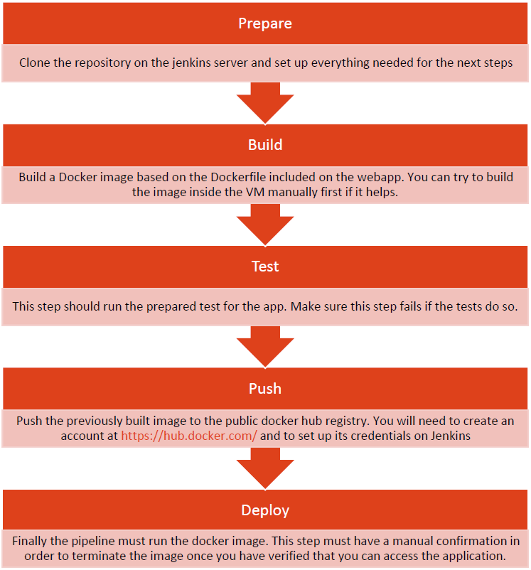

# Vagrant Jenkins build [](https://travis-ci.org/edinc/vagrant-jenkins)

Run a Jenkins 2.25 instance on Ubuntu 16.04 LTS using vagrant.

# Before you start
- Install a console with SSH (I suggest Cmder or ConEmu)
- Create an account in Dockerhub https://hub.docker.com/ 
- Disable or turn off hyper-v feature on (Windows features) and restart your pc.
- Install VirtualBox from https://www.virtualbox.org/ 
- Install Vagrant from https://www.vagrantup.com/ following https://www.vagrantup.com/docs/installation/
- Clone the following git repository https://github.com/manherfo/CI-CD-Challenge-I-2018-2.git
- In Vagrant folder, run the following commands.  
- Build the vagrant box (Keep in mind that the machine build could take several minutes):

Build the vagrant box

```
vagrant up
```

To access the Jenkins server

```
http://localhost:8080
```

or, add the following line to the hosts file

```
127.0.0.1   jenkins.local
```

and then run the server with

```
http://jenkins.local:8080
```

## First time accessing Jenkins
Since version 2.0 Jenkins has a security setup wizard when first running it after the installation.

SSH into the machine with

```
vagrant ssh
```

Locate the security password

```
cat /var/lib/jenkins/secrets/initialAdminPassword
```

and copy it into the password field on the Jenkins server.

When you finish configuring Jenkins from the web UI, restart the service

```
sudo service jenkins restart
```

# Next steps
# Step 1
- Fork the repository https://github.com/manherfo/CI-CD-Challenge-I-2018-2.git to have your own copy.

- Obtain the forked repository URL and clone it. This is the application that you will need to change for your pipeline.
# Step 2
- Install node using the right installer for your OS (https://nodejs.org/en/download/package-manager/).

- Make sure to install npm too!

- Run the following command to install the needed modules

```
npm install
```

- After that. You should be able to run the app using
```
npm start
```

- You can run the tests in the same way
```
npm test
```

# Step 3
With your environment ready, you can now proceed to create the CI Pipeline. Do NOT use Jenkinsfile based solutions. Your solution should look like this:


